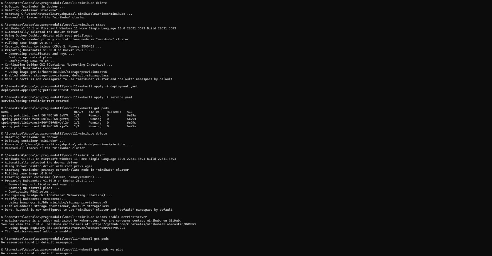

# Module 11: Deployment on Kubernetes

> #### Novrizal Airsyahputra - 2206081780 - Advance Programming B

---
**1. Compare the application logs before and after you exposed it as a Service. Try to open the app several times while the proxy into the Service is running. What do you see in the logs? Does the number of logs increase each time you open the app?**

**ANS:**

From the logs, it's evident that prior to exposing the application as a service, it was accessed directly within the pod. The logs display initial messages (such as "start server HTTP on port 8080") and each incoming request (GET /). Each time the application is accessed within the pod, a log entry is created for that request. After turning the application into a service using minikube service hello-node, the logs continue to show the initial messages and incoming requests as before. However, now the application is accessed through the service, which forwards traffic to the pod. Accessing the application through the service enables external access to the application, while accessing it within the pod remains more internal within the Kubernetes cluster.


**2. Notice that there are two versions of `kubectl get` invocation during this tutorial section. The first does not have any option, while the latter has `-n` option with value set to `kube-system`. What is the purpose of the `-n` option and why did the output not list the pods/services that you explicitly created?**

**ANS:** 

The -n option in the kubectl get command is used to specify the namespace from which resources will be displayed. If the -n option is not included, kubectl get will display resources from the default namespace. In subsequent calls, kubectl get is used with the -n kube-system option, instructing it to specifically display resources from the kube-system namespace. This namespace contains system components and infrastructure of Kubernetes itself, such as core system services like DNS, API server, and Kubernetes dashboard.

**3. What is the difference between Rolling Update and Recreate deployment strategy?**

**ANS:**
Rolling Update and Recreate are two different deployment strategies in Kubernetes, each with its own characteristics and use cases:

a. Rolling Update:

* In a Rolling Update deployment strategy, new versions of the application are gradually rolled out while old versions are gradually terminated.
* This process ensures that there's no downtime during the deployment, as the new version is gradually introduced and the old version is gradually phased out.
* Rolling updates are achieved by creating new pods with the updated version of the application and then gradually replacing the old pods with the new ones, one at a time.
* Kubernetes provides parameters to control the speed and strategy of rolling updates, such as the maxUnavailable and maxSurge options in the deployment configuration.

b. Recreate:

* In a Recreate deployment strategy, all existing instances of the application are terminated before new instances are created with the updated version.
* This approach typically results in downtime during the deployment process because there's a period where the application is not available while the old instances are terminated and the new instances are being created.
* Recreate deployments are simpler in terms of implementation but may not be suitable for applications that require high availability and cannot afford downtime during updates.

**4. Try deploying the Spring Petclinic REST using Recreate deployment strategy and document
your attempt.**

**ANS:**

Before applying the Recreate Deployment Strategy:


To apply the Recreate Deployment Strategy, I tried the manifest file with different strategy type. Also, I used the same manifest file service.


(I have already run this before so its already been configured)


**5. Prepare different manifest files for executing Recreate deployment strategy.**

**ANS:**
I created a manifest file named `recreate-deployment.yaml` based on the `deployment.yaml` in the tutorial. & changed the strategy type to Recreate. Here's the content:
```
    apiVersion: apps/v1
    kind: Deployment
    metadata:
    annotations:
        deployment.kubernetes.io/revision: "4"
    creationTimestamp: "2024-05-14T06:09:33Z"
    generation: 5
    labels:
        app: spring-petclinic-rest
    name: spring-petclinic-rest
    namespace: default
    resourceVersion: "11611"
    uid: 14543249-9677-49c0-9d47-ddcb76cd4558
    spec:
    progressDeadlineSeconds: 600
    replicas: 4
    revisionHistoryLimit: 10
    selector:
        matchLabels:
        app: spring-petclinic-rest
    strategy:
        type: Recreate
    template:
        metadata:
        creationTimestamp: null
        labels:
            app: spring-petclinic-rest
        spec:
        containers:
        - image: docker.io/springcommunity/spring-petclinic-rest:3.2.1
            imagePullPolicy: IfNotPresent
            name: spring-petclinic-rest
            resources: {}
            terminationMessagePath: /dev/termination-log
            terminationMessagePolicy: File
        dnsPolicy: ClusterFirst
        restartPolicy: Always
        schedulerName: default-scheduler
        securityContext: {}
        terminationGracePeriodSeconds: 30
    status:
    availableReplicas: 4
    conditions:
    - lastTransitionTime: "2024-05-14T06:17:13Z"
        lastUpdateTime: "2024-05-14T06:17:13Z"
        message: Deployment has minimum availability.
        reason: MinimumReplicasAvailable
        status: "True"
        type: Available
    - lastTransitionTime: "2024-05-14T06:09:33Z"
        lastUpdateTime: "2024-05-14T06:42:25Z"
        message: ReplicaSet "spring-petclinic-rest-54f476f68" has successfully progressed.
        reason: NewReplicaSetAvailable
        status: "True"
        type: Progressing
    observedGeneration: 5
    readyReplicas: 4
    replicas: 4
    updatedReplicas: 4
```

**6. What do you think are the benefits of using Kubernetes manifest files? Recall your experience in deploying the app manually and compare it to your experience when deploying the same app by applying the manifest files (i.e., invoking `kubectl apply -f` command) to the cluster.**

**ANS:** 

By employing manifest files, the deployment process becomes more standardized and documented in a declarative manner. This approach significantly reduces the likelihood of human error, as there's no reliance on memory for specific procedures. Manifest files facilitate efficient management of application configurations, eliminating the need for users to worry about cumbersome manual setups. Ultimately, this streamlines the deployment workflow and promotes consistency across deployments.

